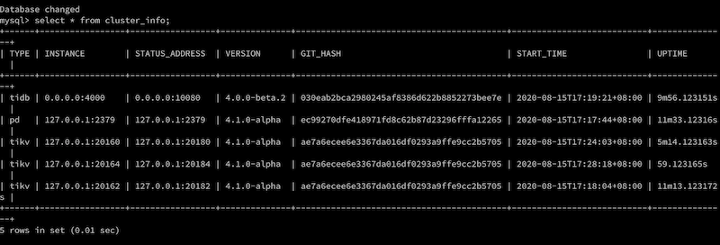

# 编译部署环境

## pd

    git clone https://github.com/pingcap/pd.git
    make
    
    # 启动一个pd
    ./pd-server

## tikv

    git clone https://github.com/tikv/tikv.git
    make

因为在一个机器上启动3个tikv实例，所以修改了tikv的config文件，修改了addr, advertise-addr, status-addr, advertise-status-bar的值，让每个实例占用不同的端口。每个实例在不同的目录下启动。

    $orgFile/tikv-server --log-file=./kv.log --config=$orgFile/kv.toml

## tidb

     git clone https://github.com/pingcap/tidb.git
     make
    
     # brew upgrade go, 本地的go版本较旧，升级了一下
     # 启动tidb, 指定pd的地址
    ./tidb-server --store=tikv --path="127.0.0.1:2379"

## 校验部署

    mysql -h 127.0.0.1 -P 4000 -u root -D test
    
    mysql> use INFORMATION_SCHEMA;
    
    mysql> select * from cluster_info;

结果如下:

# 修改让启动事务时打印"hello transaction"

    // 修改executor/simple.go
    func (e *SimpleExec) executeBegin(ctx context.Context, s *ast.BeginStmt) error {
        logutil.Logger(ctx).Info("hello transaction"); // 增加打印
        ...

周期打印"start transaction", mysql执行事务，也会打印"start transaction"。
输出结果:

